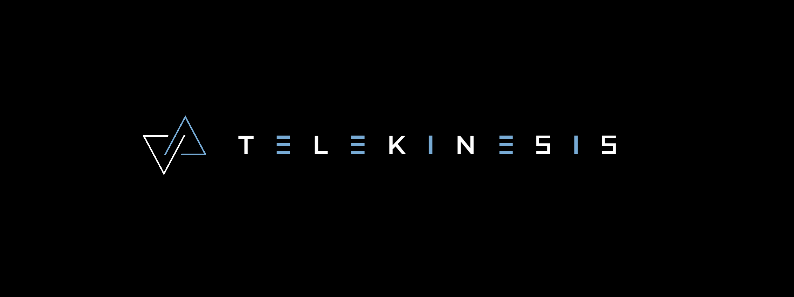

# Pose Estimation for Azure Kinect

This project is a ROS package that encompasses a pipeline to detect and estimate the 6-D pose of an object in the scene. A 3D CAD model of the object is necessary for the pipeline to function.

## Features
The ROS node can do one of two things:
1. Parse a video that was recorded by the Azure Kinect (mkv format), and generate a .csv containing the pose of the object in each frame.
2. Parse the live stream video of a connected Azure Kinect camera, and generate a .csv containing the pose of the object in each frame.

Please refer to the [usage guide](docs/USAGE.md) for more information on how to use the node.

## Building
Please refer to the [building guide](docs/BUILDING.md)

## Licence